# 钓鱼佬 - 像素风钓鱼模拟游戏

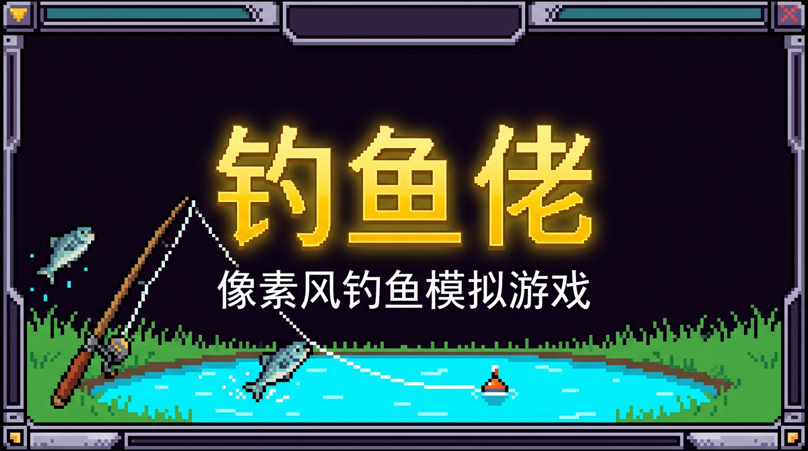

[](https://expo.dev)
[](https://reactnative.dev)
[](https://www.typescriptlang.org/)
[](https://github.com/pmndrs/zustand)
[](LICENSE)

一款面向钓鱼爱好者的像素风移动端趣味应用，集**钓鱼模拟**、**百科图鉴**、**社区推荐**、**钓鱼日记**于一体。全部视觉元素通过代码绘制，无需外部图片资源。

**在线体验**: [https://fish-agent.vercel.app](https://fish-agent.vercel.app)

## 快速开始

```bash
# 克隆项目
git clone https://github.com/ava-agent/fish-agent.git
cd fish-agent

# 安装依赖
npm install

# 启动 Web 版本
npx expo start --web
```

## 应用截图

| 钓鱼模拟 | 钓鱼百科 |
|:---:|:---:|
| 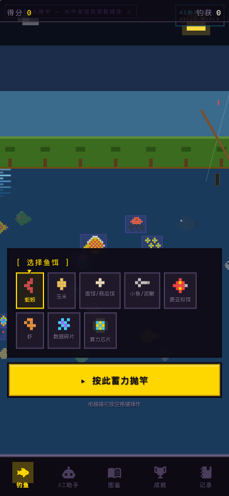 | 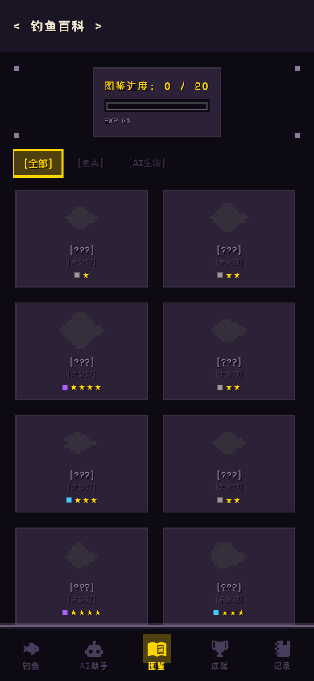 |

| 钓鱼社区 | 钓鱼记录 |
|:---:|:---:|
| 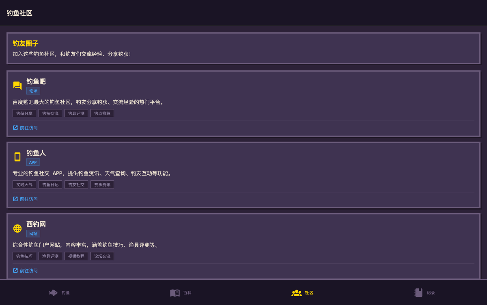 | 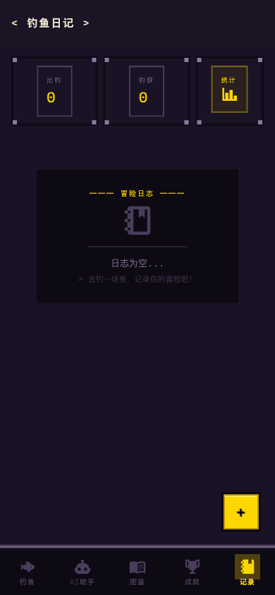 |

## 功能模块

### 1. 模拟钓鱼 (首页)

交互式钓鱼模拟游戏，完整还原钓鱼流程：

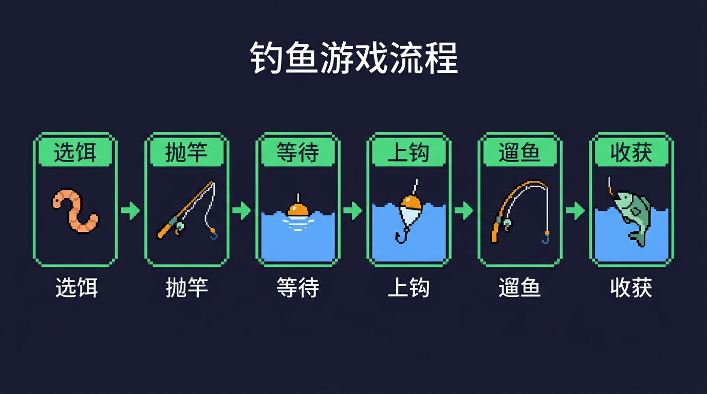

- **选饵** — 6 种鱼饵（蚯蚓/玉米/面饵/小鱼/路亚/虾），每种对不同鱼种有不同效果
- **抛竿** — 蓄力条控制抛投距离
- **等待** — 浮漂在水面浮动，鱼 AI 根据鱼饵匹配度决定是否咬钩
- **上钩** — 浮漂剧烈晃动提示，2.5 秒内点击设钩
- **遛鱼** — 核心玩法：控制线张力，画圈手势收线，消耗鱼体力
- **收获** — 展示鱼的像素图、重量、稀有度，自动记入图鉴

#### 遛鱼机制详解

遛鱼是游戏的核心玩法，需要保持线张力在**绿色区域 (30%-70%)**：

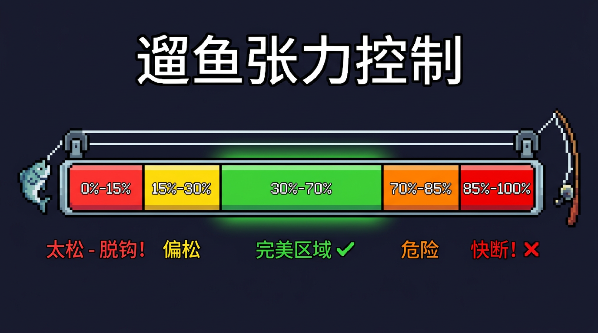

| 张力范围 | 状态 | 效果 |
|---------|------|------|
| 0% - 15% | 太松 | 鱼会脱钩逃跑 |
| 15% - 30% | 偏松 | 鱼体力不消耗 |
| **30% - 70%** | **完美** | **鱼体力快速消耗** |
| 70% - 85% | 危险 | 鱼体力缓慢消耗 |
| 85% - 100% | 快断 | 线可能断裂 |

**操作技巧**：
- 在圆圈内画圈/滑动来收线，增加张力
- 张力会自然下降（线松弛），需要持续收线
- 鱼会挣扎，随机产生拉力
- 保持张力在绿色区域才能快速消耗鱼体力

### 2. 钓鱼百科

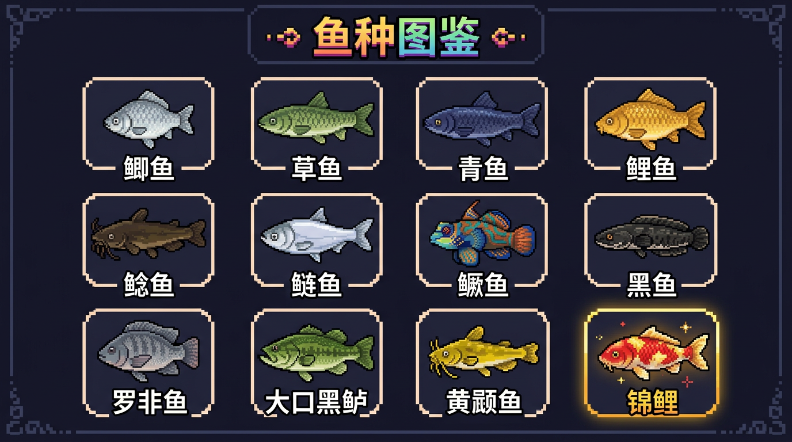

- **鱼种图鉴** — 12 种鱼（鲫鱼/草鱼/青鱼/鲤鱼/鲶鱼/鲢鱼/鳜鱼/黑鱼/罗非鱼/大口黑鲈/黄颡鱼/锦鲤），含属性、栖息地、实钓小贴士
- **钓具大全** — 11 种装备（鱼竿/鱼线/鱼钩）含属性对比
- **钓法教程** — 5 种钓法（台钓/底钓/路亚/飞蝇/夜钓）含操作步骤

### 3. 钓鱼社区

- **社区推荐** — 6 个钓鱼论坛/App/公众号推荐
- **钓点推荐** — 5 类钓鱼场所（水库/鱼塘/河流/黑坑/海边矶钓）含实用建议

### 4. 钓鱼记录

- **钓鱼日记** — 记录每次钓鱼的地点、天气、时长、鱼获
- **数据统计** — 出钓次数、总钓获、图鉴收集进度

## 技术架构

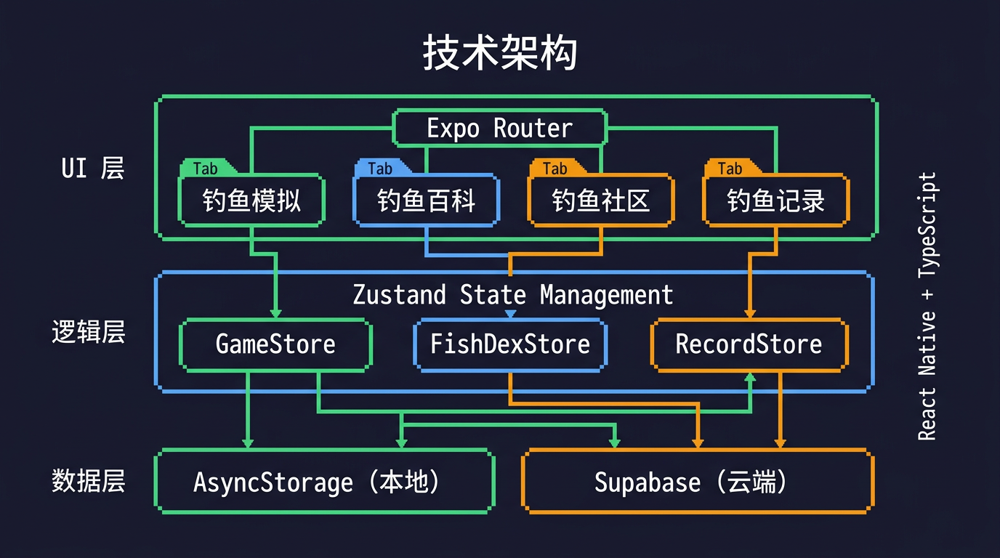

| 技术 | 用途 |
|------|------|
| React Native 0.81 + Expo SDK 54 | 跨平台框架 |
| expo-router v6 | 文件路由系统 |
| Zustand v5 | 状态管理 |
| AsyncStorage | 本地数据持久化 |
| Supabase | 云端数据库（可选） |
| React Native Animated | 动画系统 |
| PanResponder | 手势交互 |

## AI Agent 架构设计

本项目的游戏逻辑采用了 AI Agent 设计模式，将钓鱼模拟的核心玩法抽象为感知-决策-执行的智能体架构。

### 系统架构 (三层模型)

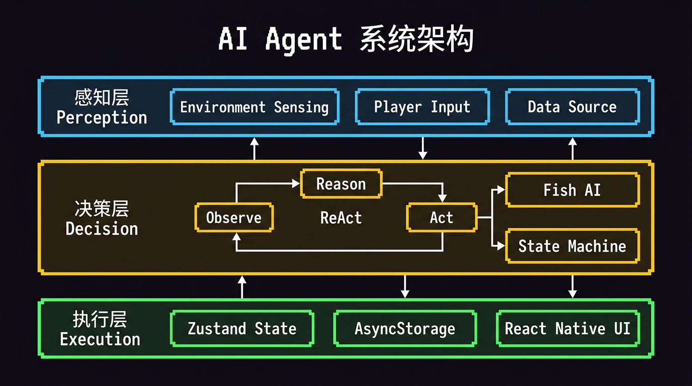

Agent 系统分为三个层次：

| 层次 | 职责 | 实现 |
|------|------|------|
| **感知层 (Perception)** | 采集环境信息和玩家输入 | 环境感知 + 玩家输入 + 数据源 |
| **决策层 (Decision)** | ReAct 循环 + Fish AI 决策 | Observe → Reason → Act 循环 |
| **执行层 (Execution)** | 状态更新与 UI 渲染 | Zustand Store + AsyncStorage + React Native UI |

### Agent 执行流程 (ReAct 模式)

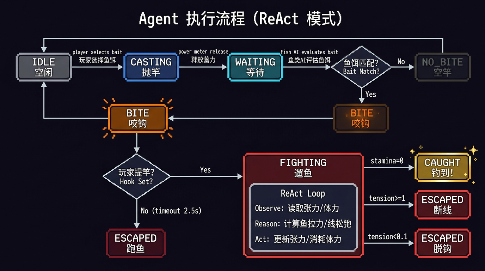

游戏状态机遵循 **ReAct (Reasoning + Acting)** 模式：

1. **Observe (观察)** — 读取当前游戏状态：线张力、鱼体力、玩家手势输入
2. **Reason (推理)** — 基于规则计算：鱼的拉力方向、咬钩概率、逃脱判定
3. **Act (行动)** — 更新游戏状态：修改张力值、消耗鱼体力、触发状态转换

核心 ReAct 循环在 **遛鱼 (Fighting)** 阶段每帧执行：
- 观察：读取 `lineTension` 和 `fishStamina`
- 推理：计算鱼的挣扎力度、判断张力是否在安全区间
- 行动：更新状态 → 张力过高则断线 (ESCAPED)、体力归零则成功 (CAUGHT)

### Agent 知识体系 (RAG 模式)

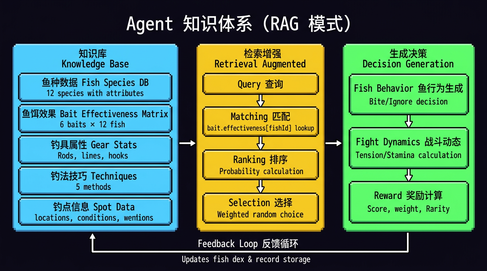

Fish AI 的决策采用类 **RAG (Retrieval-Augmented Generation)** 模式：

| 阶段 | 说明 | 示例 |
|------|------|------|
| **知识库 (Knowledge Base)** | 静态数据存储 | 12 种鱼的属性、6×12 鱼饵效果矩阵、钓具属性 |
| **检索增强 (Retrieval)** | 查询匹配 + 概率排序 | `bait.effectiveness[fishId]` 查找匹配度 → 加权随机选择 |
| **生成决策 (Generation)** | 行为输出 | 咬钩/忽略决策、战斗动态参数、奖励计算 |
| **反馈循环 (Feedback)** | 结果回写 | 更新图鉴收集状态、记录钓鱼日志 |

**知识检索流程**：玩家选择鱼饵 → 查询鱼饵效果矩阵 → 计算每种鱼的咬钩概率 → 加权随机决定哪条鱼上钩 → 根据鱼种属性生成战斗参数。

## 项目结构

```
fish-agent/
├── app/                          # Expo Router 文件路由
│   ├── _layout.tsx               # 根布局
│   ├── +html.tsx                 # 自定义 HTML 模板
│   └── (tabs)/
│       ├── _layout.tsx           # Tab 导航 (4 个 Tab)
│       ├── index.tsx             # 钓鱼模拟游戏
│       ├── encyclopedia/         # 百科模块
│       │   ├── index.tsx         # 鱼种图鉴列表
│       │   ├── [fishId].tsx      # 鱼种详情
│       │   ├── gear.tsx          # 钓具目录
│       │   └── techniques.tsx    # 钓法教程
│       ├── community/            # 社区模块
│       │   ├── index.tsx         # 社区推荐
│       │   └── spots.tsx         # 钓点列表
│       └── records/              # 记录模块
│           ├── index.tsx         # 钓鱼日记时间线
│           ├── new.tsx           # 新建记录
│           └── stats.tsx         # 统计面板
├── src/
│   ├── components/common/        # 像素风 UI 组件 (PixelText/PixelButton/PixelCard)
│   ├── data/                     # 静态数据 (鱼种/钓具/鱼饵/社区)
│   ├── game/types.ts             # TypeScript 类型定义
│   ├── stores/                   # Zustand 状态管理 (Game/FishDex/Record)
│   ├── theme/                    # 主题 (颜色/间距/字体)
│   └── utils/supabase.ts         # Supabase 客户端
├── supabase/migrations/          # 数据库迁移脚本
├── screenshots/                  # 应用截图与文档图示
├── babel.config.js               # Babel 配置 (import.meta 转换)
├── vercel.json                   # Vercel 部署配置
└── app.json                      # Expo 配置
```

## 像素风设计

所有视觉元素均通过代码绘制，无需外部图片资源：

- 鱼类精灵使用 2D 数字矩阵 + 调色板渲染
- 场景元素（天空、太阳、树木、草地、水面）使用 View 组件拼接
- 水面动画使用正弦波驱动蓝色方块的垂直偏移
- UI 组件统一使用像素风边框和配色方案

## 本地开发

```bash
# 安装依赖
npm install

# 启动开发服务器
npx expo start

# 启动 Web 版本
npx expo start --web

# 启动 iOS 模拟器
npx expo start --ios

# 启动 Android 模拟器
npx expo start --android
```

## 部署

### Vercel (Web)

项目已配置 `vercel.json`，支持一键部署：

```bash
# 安装 Vercel CLI
npm i -g vercel

# 部署
vercel
```

或通过 GitHub 连接 Vercel 实现自动部署。

### Supabase (可选)

如需云端数据同步：

1. 创建 Supabase 项目
2. 复制 `.env.example` 为 `.env` 并填入 Supabase 凭据
3. 执行 `supabase/migrations/001_initial_schema.sql` 创建数据库表

## 环境变量

```env
EXPO_PUBLIC_SUPABASE_URL=your_supabase_url
EXPO_PUBLIC_SUPABASE_ANON_KEY=your_supabase_anon_key
```

## 数据模型

### 游戏状态 (useGameStore)

| 字段 | 类型 | 说明 |
|------|------|------|
| phase | GamePhase | 游戏阶段 (idle/casting/waiting/hooking/fighting/caught/escaped) |
| currentFish | FishSpecies | 当前上钩的鱼 |
| lineTension | number | 线张力 (0-1) |
| fishStamina | number | 鱼体力 (0-1) |
| reelSpeed | number | 收线速度 (0-1) |
| score | number | 累计分数 |
| totalCatches | number | 累计钓获数 |

### 图鉴状态 (useFishDexStore)

| 字段 | 类型 | 说明 |
|------|------|------|
| entries | FishDexEntry[] | 图鉴条目列表 |
| discoveredCount | number | 已发现鱼种数 |

### 钓鱼记录 (useRecordStore)

| 字段 | 类型 | 说明 |
|------|------|------|
| records | FishingRecord[] | 钓鱼日记列表 |
| totalTrips | number | 出钓次数 |

## 常见问题

### Web 端 `import.meta` 错误

如果遇到 `Cannot use 'import.meta' outside a module` 错误，确保 `babel.config.js` 配置正确：

```javascript
module.exports = function (api) {
  api.cache(true);
  return {
    presets: [
      ['babel-preset-expo', { unstable_transformImportMeta: true }],
    ],
  };
};
```

### Web 端 `useNativeDriver` 警告

React Native Web 不支持 `useNativeDriver`，代码中已使用 `Platform.OS !== 'web'` 条件处理。

### 手势在 Web 端不响应

游戏中的收线手势需要触摸或鼠标拖动操作。移动端触摸体验最佳。

## 更新日志

### v1.1.0
- 新增：首次打开显示游戏教程
- 新增：张力表显示最佳区域指示器
- 修复：遛鱼系统平衡性调整，现在需要主动操作才能成功
- 修复：分数和钓获数在继续游戏时不再重置
- 修复：抛竿蓄力值不再丢失
- 优化：现在所有 12 种鱼都会出现在水中
- 优化：没有鱼上钩时显示提示信息

### v1.0.0
- 初始版本发布
- 完整钓鱼模拟游戏
- 12 种鱼种图鉴
- 6 种鱼饵系统
- 钓鱼日记记录功能

## 贡献指南

欢迎贡献代码、报告问题或提出建议！

1. Fork 本仓库
2. 创建功能分支 (`git checkout -b feature/amazing-feature`)
3. 提交更改 (`git commit -m 'feat: 添加某个功能'`)
4. 推送到分支 (`git push origin feature/amazing-feature`)
5. 创建 Pull Request

### 代码规范

- 使用 TypeScript 编写代码
- 遵循现有的代码风格
- 添加必要的注释

## 技术支持

如有问题或建议，请 [提交 Issue](https://github.com/ava-agent/fish-agent/issues)。

## License

MIT
